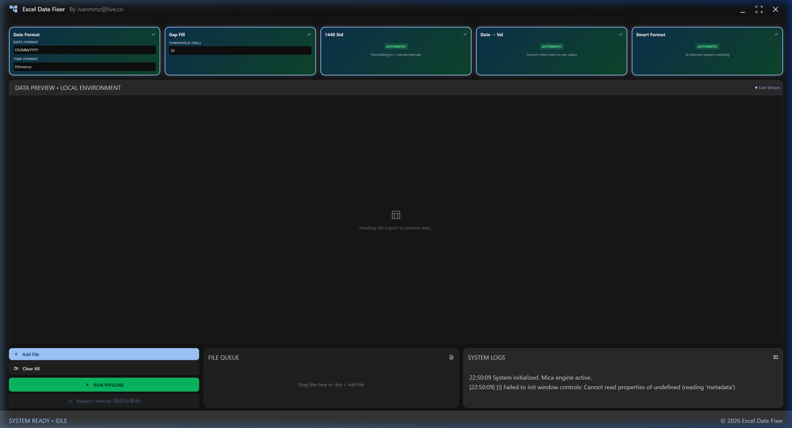
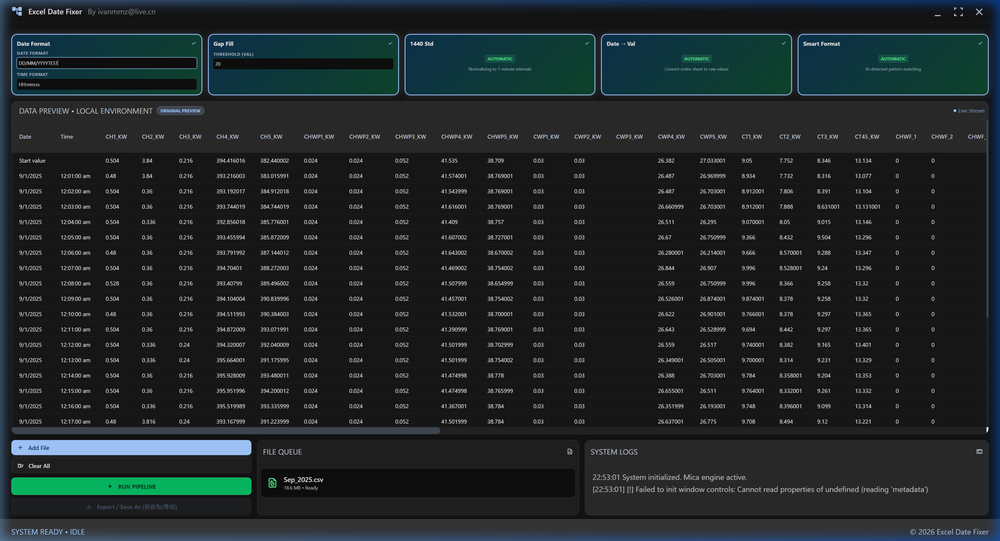
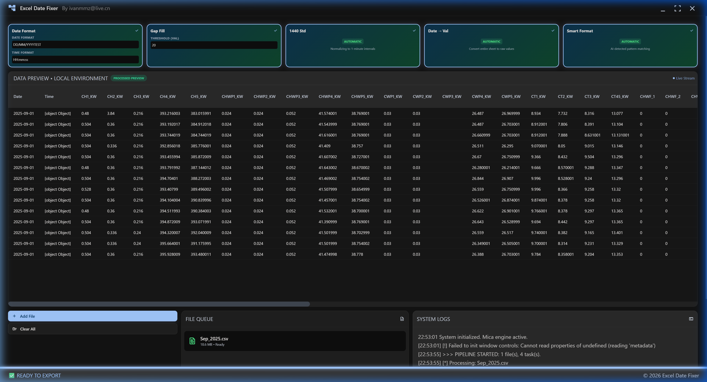

# Excel Date Fixer Pro

A high-performance, modern desktop and web utility built with **Tauri 2 + Vite + Tailwind CSS + ExcelJS** designed to clean, normalize, format, and fix date/time-stamped datasets (Excel and CSV files).

This application features a Material Design 3 dark theme with native-like mica translucency, dynamic data previewing, and a real-time system log panel to monitor the pipeline's progress.

---

## 📸 Interface Preview

### Initial Dashboard
The clean, modern Material Design 3 interface with all task settings and file options readily accessible:


### Data Import & Original Preview
Once a CSV or Excel file (such as `Sep_2025.csv`) is uploaded, a quick, optimized preview shows the raw data headers and the first few rows of data:


### Pipeline Processing & Success State
After running the pipeline, the system logs execution steps in real-time, displays a green `PROCESSED PREVIEW` badge, updates the table preview, and allows exporting the cleaned Excel sheet:


---

## 🚀 Key Features

Excel Date Fixer Pro runs a sequential multi-task pipeline to cleanse date-time datasets:

1. **Date Format Correction** (`date_format`)
   - Smart Month/Day swap detection (e.g. DD/MM vs MM/DD) when dates are ambiguous.
   - Cleans delimiters (normalizes periods `.` or dashes `-` to standard forward slashes `/`).
   - Automatically detects time components and maintains format parity.
   
2. **Gap Fill (Forward Fill)** (`fix_missing`)
   - Automatically scans numerical columns for empty/null values.
   - Forward-fills gaps up to a user-defined threshold (e.g. 20 consecutive rows).
   - Automatically protects Date/Time column fields to ensure timestamp integrity.

3. **1440 Minute-by-Minute Standardization** (`standard_1440`)
   - Groups records by calendar day.
   - Deduplicates multiple records falling within the same minute, preserving the first observation.
   - Pads incomplete days up to exactly 1,440 rows (1 record per minute), copying the last observed values forward.
   - Critical for power system profiles, load analyses, and meteorological data modeling.

4. **Date to Value Conversion** (`date_to_value`)
   - Converts Date and Time columns to raw Excel serial numbers (fractional representation of days since Dec 30, 1899).
   - Useful for feeding cleaned outputs directly into analytics engines or formulas.

5. **Smart Excel Formatting & Formulas** (Automatic)
   - Converts JS Date objects into native Excel Date objects styled with standard formatting strings (e.g., `DD/MM/YYYY`).
   - Replaces raw time strings with active `=TIME(hour, minute, second)` formulas, preserving spreadsheet formula-based time calculations.

---

## 🛠️ Step-by-Step Walkthrough with `Sep_2025.csv`

To perform a test run with the sample load profile data `C:\Users\Ivan\Desktop\Sep_2025.csv`:

1. **Add the File**: Click **`+ Add File`** at the bottom-left panel, and select `Sep_2025.csv` from the file chooser (or drag-and-drop it anywhere into the window).
2. **Review Initial Preview**: The preview table will display the headers (`Date`, `Time`, `CH1_KW`, etc.) and the original data showing any formatting issues or empty time cells.
3. **Configure Options**:
   - Set **Date Format** to `DD/MM/YYYY` and **Time Format** to `HH:mm:ss`.
   - Set **Threshold (Val)** for Gap Fill to `20`.
   - Ensure the required tasks (**Date Format**, **Gap Fill**, **1440 Std**) are selected (active tasks show a checked mark on their card).
4. **Execute**: Click **`RUN PIPELINE`**.
   - The status bar will show `PROCESSING...` as the progress bar rises.
   - The **System Logs** will show live steps: parsing `Sep_2025.csv`, swapping DD/MM formats, filling gaps, standardizing daily intervals, and writing rows.
5. **Preview & Export**:
   - Once completed, the badge changes to `PROCESSED PREVIEW` (in green).
   - Review the fixed time formatting and the filled numerical cells.
   - Click **`Export / Save As`** to save the standardized, fixed Excel workbook as a `.xlsx` file.

---

## 🖥️ Running Locally

### Prerequisites
* **Node.js** v18+ (LTS recommended)
* **Rust** (for Tauri desktop compilation)

### Install Dependencies
To install dependencies automatically on Windows, run the script:
```cmd
./requirement.win.cmd
```
For macOS/Linux:
```bash
chmod +x requirement.mac.sh && ./requirement.mac.sh
```
Or manually install using:
```bash
npm install
```

### Start Development Server
To launch the hot-reloaded Tauri application shell:
```bash
npm run dev:tauri
```
To run the project in a local web browser environment instead:
```bash
npm run dev
```
Open [http://localhost:5173](http://localhost:5173) in your browser.

### Build Standalone App
To build the production installer:
```bash
npm run build:tauri
```
The standalone installer will be outputted under `src-tauri/target/release/bundle/`.

---

## 📁 Project Structure

```
excel-date-fixer/
├── index.html                  # Main UI layout
├── src/
│   ├── style.css               # Tailwind CSS theme & mica effects
│   ├── dataProcessor.js        # Core Excel & CSV data parsing/formatting algorithms
│   └── main.js                 # UI logic, file queue management, & Tauri bridging
├── docs/
│   └── images/                 # Walkthrough screenshots
├── src-tauri/
│   ├── Cargo.toml              # Rust configuration
│   ├── tauri.conf.json         # Tauri application configuration
│   └── src/main.rs             # Tauri entry point
├── package.json                # npm dependencies & script commands
└── vite.config.js              # Vite server & build configurations
```

---

## License
This project is licensed under the MIT License - see the [LICENSE](LICENSE) file for details.

## Contributing
Contributions are welcome! Please feel free to submit a Pull Request. 
By submitting a PR, you agree to license your contributions under the same [MIT License](LICENSE).

---

## Buy Me a Coffee / Support
If Excel Date Fixer Pro helped you save time and fix your datasets, feel free to support the developer! ☕


